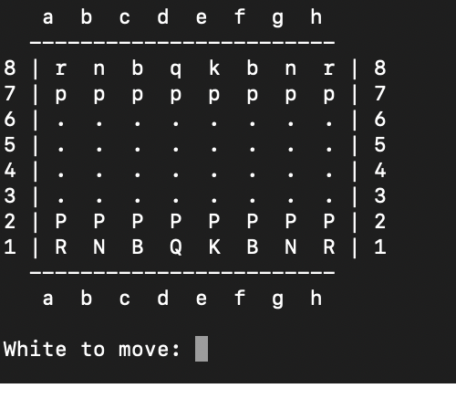

# ♟️ Analog Chess ♟️

> A minimal, beautiful terminal-based chess game designed to **teach you the board, piece movement, and fundamentals**, by **playing**.

---

## Why?

Most chess apps do too much.

This one does just enough.

Strips chess down to its essentials so you can:

* Learn **square coordinates** (**a1** to **h8**) naturally
* Understand **how each piece moves**
* Build intuition through **pure gameplay**
* Focus without **UI distractions**, just **CLI strategy**

It’s not about winning fast, but rather **learning deeply**.

---

## Features

* **Two-player terminal gameplay**
* **Algebraic input** (`e2e4`, `g1f3`)
* **Legal move validation**
* **Check, checkmate, stalemate detection**
* **Pawn promotion (auto to Queen)**
* **Clean ASCII board rendering**
* **No unnecessary complexity (no castling, en passant)**

---

## Demo

```
   a  b  c  d  e  f  g  h
  ------------------------
8 | r  n  b  q  k  b  n  r | 8
7 | p  p  p  p  p  p  p  p | 7
6 | .  .  .  .  .  .  .  . | 6
5 | .  .  .  .  .  .  .  . | 5
4 | .  .  .  .  .  .  .  . | 4
3 | .  .  .  .  .  .  .  . | 3
2 | P  P  P  P  P  P  P  P | 2
1 | R  N  B  Q  K  B  N  R | 1
  ------------------------
   a  b  c  d  e  f  g  h
```



---

## Getting Started

### 1. Clone the repo

```bash
git clone https://github.com/your-username/analog-chess.git
cd analog-chess
```

### 2. Run the game

```bash
python3 play.py
```

---

## How to Play

* Moves are entered in **coordinate notation**:

  ```
  e2e4
  g1f3
  ```

* Or with space:

  ```
  e2 e4
  ```

* Type:

  ```
  quit
  ```

  to exit.

---

## What You’ll Learn

This project is intentionally built to reinforce:

### Board Awareness

* Instantly recognize squares like `e4`, `d5`, `f7`

### Piece Movement

* How each piece moves **without hints or highlights**

### Game Logic

* Check vs checkmate vs stalemate
* Legal vs illegal moves

---

## Code Overview

Core logic includes:

* `create_starting_board()` → initializes board
* `print_board()` → renders ASCII board
* `parse_move()` → converts input → coordinates
* `is_legal_move()` → validates moves
* `is_in_check()` → detects threats
* `has_any_legal_moves()` → game state evaluation

The full implementation is included here: 

---

## Design Philosophy

* **Minimal > Feature Rich**
* **Learning > Convenience**
* **Clarity > Abstraction**

Every line of code exists to reinforce understanding.

---

## Future Improvements

* Castling
* En passant
* Move history
* AI opponent
* PGN export

---

## Final Thought

* If you can play chess *without visual aids*, you don’t just play, you understand.

* Learn chess the **hard** way, learn chess the the **right** way.
